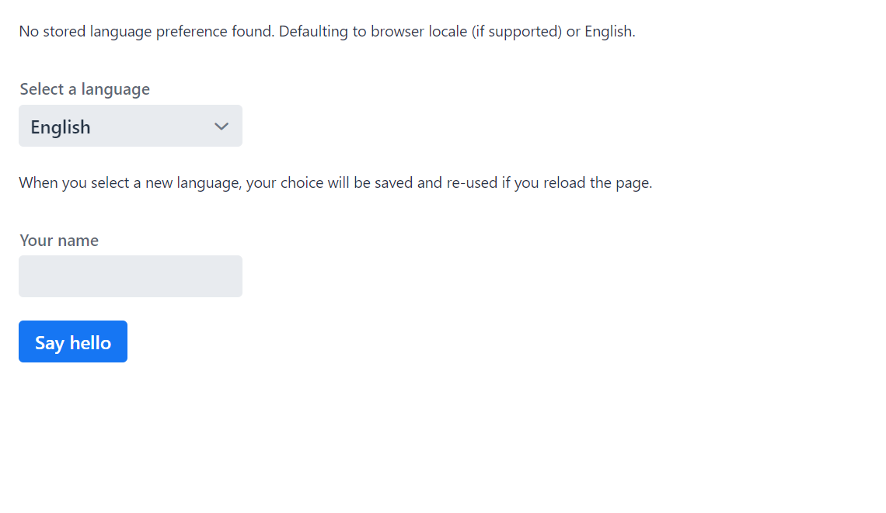

# Project example for implementing localization in a Vaadin Flow application

This example application demonstrates implementing internationalization and localization in a Vaadin Spring Boot project.
Locales supported are English, Finnish and French.

Among the classes under the `com.vaadin.example` package
- `Application.java` is responsible for running the application
- `GreetService.java` supplies localized greetings
- `MainView.java` is the main view, and an entry point for the application
- `ServiceInitListener.java` customises start-up process by setting a locale for the application
- `SimpleI18NProvider.java` is a simple implementation of a `I18NProvider`

Resource bundles with the name `labelsbundle`, which contain the actual translations, are located under the `/resources` folder.

## Running the Application

Import the project to the IDE of your choosing as a Maven project.

Run the application using `mvn spring-boot:run` or by running the `Application` class directly from your IDE.

Open http://localhost:8080/ in your browser.

If you want to run the application locally in the production mode, run `mvn spring-boot:run -Pproduction`.

## More information
- A tutorial on I18N localization at official docs [I18N localization](https://vaadin.com/docs/flow/advanced/tutorial-i18n-localization.html)
- A tutorial on internationalization in Vaadin Flow [Internationalization in Vaadin Flow](https://vaadin.com/learn/tutorials/i18n/i18nprovider)
